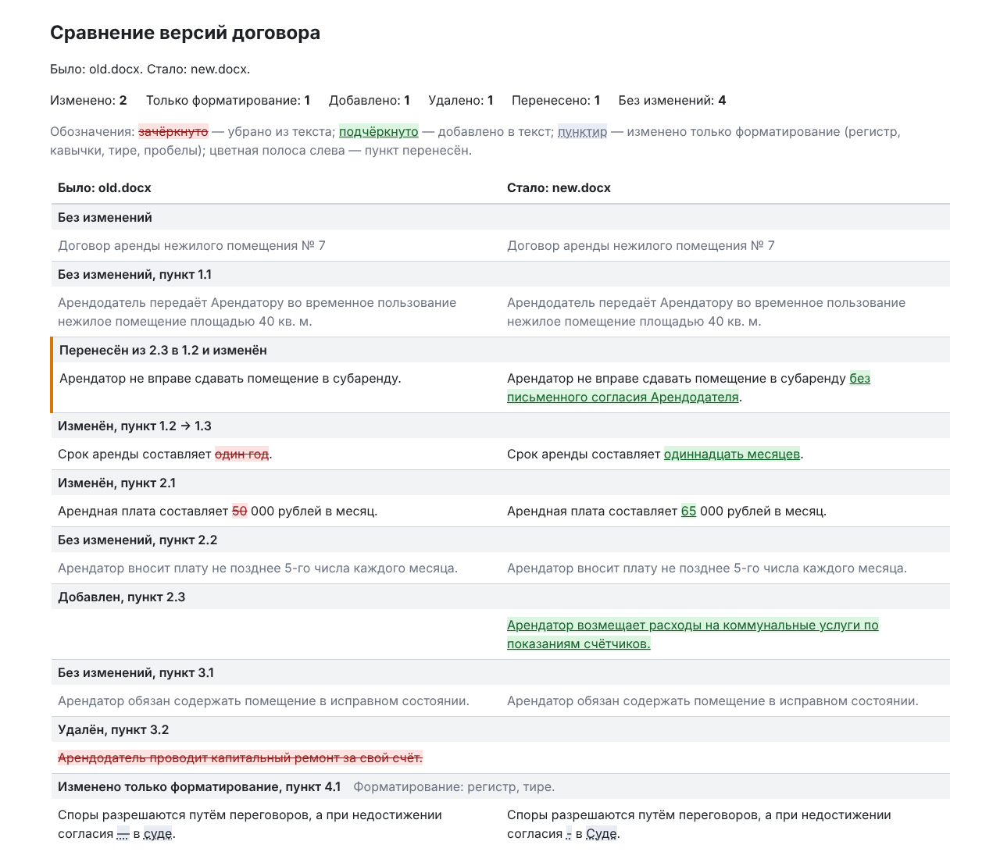

# doc-diff

doc-diff показывает, что изменилось между двумя версиями договора в PDF или DOCX: добавленные, удалённые, изменённые и перенесённые пункты. Результат — текстовый отчёт в терминале или самодостаточный HTML-файл с двумя колонками.

Для тех, кому присылают «исправленную версию» договора и нужно быстро понять, что в ней поменяли: юристов, фрилансеров, арендаторов.

## Установка

Нужны Python 3.12+ и [uv](https://docs.astral.sh/uv/):

```
uv sync
```

## Запуск

Версии могут быть в разных форматах: например, старая в PDF, новая в DOCX.

```
uv run doc-diff old.pdf new.docx
```

Отчёт печатается текстом. Чтобы сохранить его в HTML-файл, добавьте `-o`:

```
uv run doc-diff old.pdf new.docx -o report.html
```

HTML-файл не требует интернета и скриптов: его можно открыть в любом браузере и переслать как есть. В отчёте только имена файлов, без путей.

Справка: `uv run doc-diff --help`.

## Пример

В папке `examples/` лежат два выдуманных договора аренды:

```
uv run doc-diff examples/old.docx examples/new.docx -o report.html
```



Файлы `examples/old.docx` и `examples/new.docx` пересоздаются командой `uv run python -m examples.build_examples`.

## Как читать отчёт

Сверху — сводка: сколько пунктов изменено, сколько только переформатировано, добавлено, удалено, перенесено и сколько осталось без изменений. Ниже — таблица: слева «Было», справа «Стало», пункты идут в порядке новой версии. У каждой записи есть подпись со статусом и номерами пункта.

Статусы:

- **Изменён** — изменился смысл текста.
- **Изменено только форматирование** — различия лишь в оформлении (см. ниже).
- **Добавлен** — пункта не было в старой версии.
- **Удалён** — пункта нет в новой версии.
- **Перенесён** — пункт стоит в другом месте относительно остальных; подпись называет, откуда и куда он переехал, и отмечает, если текст тоже менялся.
- **Без изменений** — текст тот же; такие пункты показаны приглушённым цветом.

Обозначения в HTML-отчёте (цвет — не единственный признак):

- зачёркнутый текст на красноватом фоне — убрано из текста;
- подчёркнутый текст на зеленоватом фоне — добавлено в текст;
- пунктирное подчёркивание на спокойном фоне — изменено только форматирование; рядом с подписью записи названо, какое именно;
- цветная полоса слева от записи — пункт перенесён.

### Что считается форматированием

Различия, которые не меняют смысла договора:

- регистр букв («суде» и «Суде»);
- виды кавычек («…», "…", „…“);
- тире и дефисы («—», «–», «-»);
- пробелы (в том числе неразрывные).

### Что считается переносом

Пункт считается перенесённым, когда он переставлен относительно остальных пунктов. Если номера сдвинулись из-за вставленных или удалённых пунктов, а порядок остальных не изменился, это не перенос: в подписи будет стрелка «пункт 1.2 → 1.3».

## Коды выхода

- `0` — сравнение выполнено (и отчёт сохранён, если задан `-o`);
- `1` — ошибка с документом или с файлом отчёта: файл не найден, формат не поддерживается, файл повреждён или защищён паролем, нет текста, отчёт не удалось записать, файл отчёта совпадает с одной из версий;
- `2` — неверные аргументы командной строки.

Сообщение об ошибке выводится одной строкой в stderr.

## Известные ограничения

- Автоматическая нумерация Word не восстанавливается: такие пункты считаются пунктами без номера.
- Сканы без текстового слоя не читаются: в них нет текста, который можно сравнить.
- Файл без прав на чтение пока даёт техническую ошибку вместо понятного сообщения.
- Пробел внутри числа («10 000» → «100 00») считается форматированием, хотя число изменилось.
- Пункты от 2000 слов сравниваются медленно: секунды на пункт.
- Похожие пункты, поменявшиеся местами «крест-накрест», могут дать лишнюю отметку о переносе.
- В PDF дефис составного слова на переносе строки («из-» / «за») пропадает.

## Разработка

```
make check
```

Запускает ruff, mypy и pytest. Правила проекта — в `AGENTS.md`.
